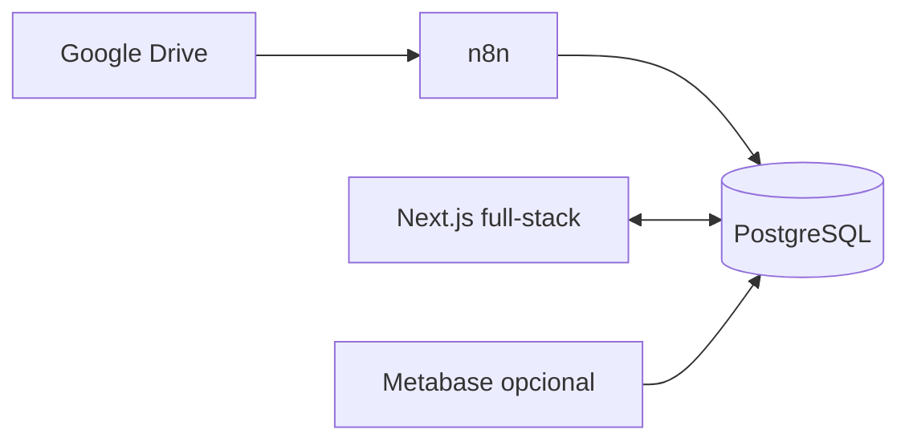

# Arquitectura inicial

## Decision principal

Construir una app propia con Next.js full-stack en la raiz del repo:

- `src/app/`: rutas, layouts, pantallas, Server Components y Route Handlers.
- `src/server/`: Server Actions, servicios de negocio y validaciones.
- `src/db/`: conexion PostgreSQL, queries tipadas y repositorios.
- `src/components/`: componentes React de UI.
- `docs/`: documentos de producto, arquitectura y planes.
- `skills/`: skills versionables propias del proyecto.
- Metabase sigue disponible para graficos o listados analiticos, pero no es la interfaz principal de gestion.

Esta opcion aprovecha que el usuario ya conoce Next.js y evita mantener dos aplicaciones mientras el producto sigue siendo interno y de baja exposicion publica.

## Evaluacion de alternativas

### Opcion recomendada: Next.js full-stack

Vale la pena usar Next.js aunque no haya SEO. El beneficio aca no es SEO: es productividad, routing, layouts, Server Components, Server Actions, Route Handlers, build integrado y despliegue simple. Para este MVP, un backend separado no parece necesario porque las operaciones son formularios, listados, correcciones y calculos sobre PostgreSQL.

La condicion es no mezclar SQL crudo por todos lados: la logica debe vivir en `src/server/` y `src/db/`, con tests para reglas delicadas como faltantes, duplicados e historico de reglas.

### Opcion descartada por ahora: React puro + Express

React puro con Vite + Express funcionaria, pero agrega dos piezas, dos servidores, CORS, contratos HTTP internos y mas mantenimiento. Tiene sentido si despues se necesita una API publica, mobile app, integraciones externas o workers separados.

### Opcion descartada por ahora: Next.js + NestJS

Es robusta, pero pesada para arrancar este proyecto. NestJS se puede agregar despues si el dominio crece o si la app necesita API independiente.

## Flujo de datos



## Estrategia de datos para desarrollo

Para la Fase 0, el desarrollo usa una base PostgreSQL local levantada con `docker-compose.yml`. Esa base permite iterar el scaffold, la autenticacion, los repositorios y los tests sin depender de la disponibilidad de los flujos n8n ni arriesgar datos reales.

En entornos conectados a la operacion real, la app debe apuntar a la misma base PostgreSQL que alimentan los flujos n8n mediante `DATABASE_URL`. El string esperado tiene esta forma, sin credenciales reales en el repositorio:

```bash
DATABASE_URL=postgresql://APP_USER:APP_PASSWORD@DB_HOST:DB_PORT/DB_NAME
```

La app no crea una copia propia de negocio ni sincroniza datos: solo cambia el destino de conexion por entorno.

## Responsabilidades

| Componente | Responsabilidad |
| --- | --- |
| n8n | Detectar comprobantes, extraer datos, clasificar categorias y poblar tablas. |
| PostgreSQL | Fuente de verdad compartida. |
| Next.js server | Auth, validacion, reglas de negocio, CRUD, calculo de faltantes/duplicados. |
| Next.js UI | Operacion diaria: listar, filtrar, corregir, configurar reglas y revisar faltantes. |
| Metabase | Reportes/graficos no bloqueantes para v1. |

## Primeras pantallas

- Login.
- Inicio operativo: alerta de documentos a revisar, faltantes, duplicados, filtros, graficos y listados.
- Documentos: listado filtrable + detalle/correccion en pantalla dividida.
- Categorias: arbol navegable; cada nodo permite configurar reglas de pago.
- Usuarios: alta simple de usuarios.
- Reportes: entrada opcional a Metabase si se conserva.

## Disenio de interfaz

La app debe sentirse como herramienta interna de control: densa, escaneable y rapida. No necesita landing page ni hero. La primera pantalla despues del login es el tablero operativo.

Los filtros superiores combinan periodo fiscal y categoria. Las categorias se presentan como una nube de botones/chips: primero categorias raiz, luego subcategorias segun la seleccion. Cada seleccion actualiza faltantes, duplicados, graficos y listas.

La primera informacion visible debe ser accionable: documentos que requieren intervencion, posibles faltantes y posibles duplicados. Los graficos aparecen despues como apoyo analitico.

## Metabase

Metabase queda como opcional. Puede usarse para la card del grafico de torta si resulta mas rapido o si ya hay dashboards recuperables, pero la app no debe depender de Metabase para mostrar faltantes, duplicados, revision ni reglas.

Mientras `metabase_data/` exista, se conserva para posible recuperacion. No se incluye Metabase en `docker-compose.yml` inicial.

## Decisiones abiertas

- Confirmar si Metabase se mantiene como stack separado. No es necesario para empezar la app.
- Definir si la autenticacion sera solo cookie de sesion o JWT con cookie httpOnly. Recomendacion inicial: cookie httpOnly.
